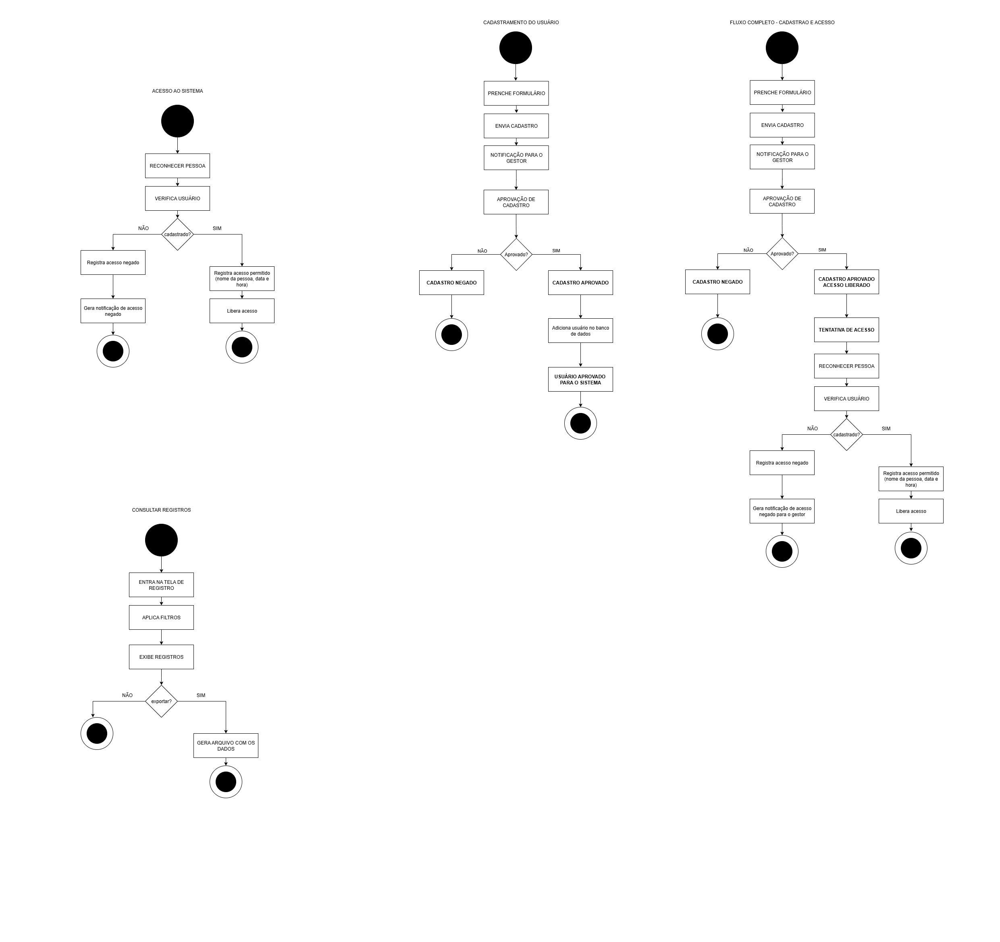

# Diagramas - FacePass

Este documento descreve os diagramas de sistema propostos para o projeto FacePass, em conformidade com a Atividade 2 da disciplina de Engenharia de Software. O objetivo é explicar e justificar a escolha dos diagramas utilizados para modelar os aspectos estruturais e comportamentais do sistema.

## Localização dos Arquivos

Este documento, assim como as imagens dos diagramas, está localizado na pasta `diagrams/` do repositório.

---

## 1. Diagrama Estrutural - Diagrama de Classes

### Justificativa da Escolha

O Diagrama de Classes foi escolhido por ser uma ferramenta fundamental da UML para representar a **estrutura estática** de um sistema orientado a objetos. Ele nos ajuda a:
- **Visualizar as entidades centrais** do sistema (Gestor, Usuário, Câmera, etc.).
- **Definir os atributos e responsabilidades** (métodos) de cada entidade.
- **Entender as relações** de associação, dependência e herança entre as classes.

Para o FacePass, este diagrama serve como um *blueprint* para o desenvolvimento do código, garantindo que a estrutura do software seja coesa, bem definida e alinhada com os requisitos do projeto.

### Descrição do Diagrama

O diagrama apresenta as seguintes classes principais:

- **`GESTOR`**: Representa o administrador do sistema. É responsável por gerenciar cadastros (aprovar ou rejeitar), gerenciar usuários (cadastrar, atualizar, remover) e consultar logs de acesso e receber notificações.
- **`USUARIO`**: Representa um indivíduo cadastrado no sistema com permissão de acesso. Possui dados pessoais e uma foto para o reconhecimento.
- **`REGISTROACESSO`**: Modela um log de cada tentativa de acesso, seja ela bem-sucedida ou negada. Contém informações como o usuário (se identificado), data, hora, câmera e o resultado do reconhecimento.
- **`CAMERA`**: Representa o dispositivo físico que captura as imagens para o reconhecimento facial.
- **`RECONHECIMENTO`**: Classe que encapsula a lógica de processar uma imagem capturada pela câmera, validando-a e retornando um nível de confiança.
- **`NOTIFICACAO`**: Representa as mensagens enviadas ao gestor, principalmente em casos de tentativas de acesso negadas, conforme definido em uma das histórias de usuário.

As relações mostram como as classes interagem. Por exemplo, um `GESTOR` gerencia (`Aprova/Gerencia`) múltiplos `USUARIO`s e consulta (`consulta`) vários `REGISTROACESSO`s. Cada `REGISTROACESSO` é gerado a partir de um `RECONHECIMENTO` e pode, por sua vez, gerar uma `NOTIFICACAO`.

---

## 2. Diagrama Comportamental - Diagrama de Atividades

### Justificativa da Escolha

O Diagrama de Atividades foi selecionado para modelar os **aspectos dinâmicos** e os fluxos de trabalho do sistema. Ele é ideal para:
- **Descrever processos passo a passo**, mostrando o fluxo de controle.
- **Mapear os cenários de uso** descritos nas Histórias de Usuário.
- **Visualizar decisões e ações** que ocorrem durante a interação do usuário com o sistema.

Para o FacePass, este diagrama foi construido para ilustrar os fluxos principais, como o cadastro de um novo usuário, o processo de reconhecimento facial para acesso e a consulta de relatórios pelo gestor.

### Descrição do Diagrama e Relação com as Histórias de Usuário

O diagrama é composto por quatro fluxos principais que atendem diretamente às Histórias de Usuário (HU) definidas.

#### **Fluxo de Cadastro e Gerenciamento (US1: Gerenciar usuários)**

O diagrama ilustra o processo **"CADASTRO NOVO USUÁRIO"**.
1. O usuário preenche um formulário.
2. O cadastro é enviado para o `GESTOR`.
3. O `GESTOR` analisa e toma uma decisão (`APROVAÇÃO DO CADASTRO`).
4. Se aprovado, o usuário é inserido no banco de dados; caso contrário, o cadastro é negado.

Este fluxo cobre os critérios de aceitação da **US1**, demonstrando como o gestor cadastra e aprova novos usuários no sistema.

#### **Fluxo de Monitoramento de Registros (US2: Monitorar registros de acesso)**

O processo **"CONSULTAR REGISTROS"** modela exatamente esta história.
1. O gestor acessa a tela de relatórios.
2. Aplica filtros (por usuário, data, etc.).
3. O sistema exibe os registros correspondentes.
4. O gestor tem a opção de exportar os dados.

Isso atende diretamente aos critérios da **US2**, que exige a visualização, filtragem e exportação de um relatório de acessos.

#### **Fluxo de Acesso e Notificação (US3: Notificações de Tentativa de Acesso Negado)**

O fluxo **"ACESSO AO SISTEMA"** demonstra o processo de autenticação.
1. Uma pessoa é reconhecida pela câmera.
2. O sistema verifica se o usuário está cadastrado e tem permissão (`VERIFICA USUARIO`).
3. **Se o acesso é negado (`não`)**, um registro de acesso negado é criado e, crucialmente, uma **notificação é gerada para o gestor**.

Este caminho do fluxo atende perfeitamente à **US3**, garantindo que o gestor seja notificado sobre tentativas de acesso malsucedidas. O fluxo também cobre o caso de sucesso, onde o acesso é liberado.

#### **Fluxo Completo**
O diagrama "FLUXO COMPLETO - CADASTRO E ACESSO" integra os processos, mostrando a jornada de um usuário desde o preenchimento do formulário de cadastro até a sua primeira tentativa de acesso ao sistema, demonstrando a visão geral do funcionamento do FacePass.